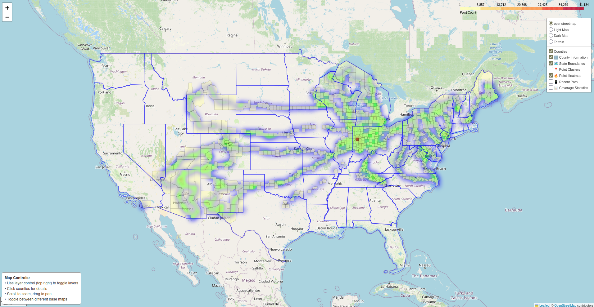

# WanderGlyph

[](https://www.python.org/)
[](./LICENSE)
[](#)

**Wanderglyph** is a Python toolkit for visualizing and analyzing GPS journeys with interactive maps, heatmaps, and detailed coverage summaries.

---

## ✨ Features

- 📍 Parse GPS coordinate data from JSON files
- 🗺️ Map coordinates to U.S. counties and states
- 🌐 Generate interactive web-based maps with:
  - Highlighted counties and GPS points
  - State boundaries
  - Heatmaps showing point density
  - Clustered location markers
  - Recent path trajectories
  - Coverage statistics and summaries

---

## 📦 Requirements

- Python 3.7+
- Packages listed in [`requirements.txt`](./requirements.txt)
- U.S. county and state shapefiles  
  ([Download from U.S. Census Bureau TIGER/Line](https://www.census.gov/geographies/mapping-files/time-series/geo/tiger-line-file.html))
- GPS data in JSON format (e.g., from Google Maps Timeline)

### How to Export GPS Data (Android)

1. Open **Settings** ➔ **Location** ➔ **Location Services** ➔ **Timeline**.
2. Tap **Export Timeline data**
3. Follow the steps to export your location history as a JSON file.

---

## 🚀 Installation

1. Clone the repository:
   ```bash
   git clone https://github.com/yourusername/wanderglyph.git
   cd wanderglyph
2. Install the dependencies:
   ```bash
   pip install -r requirements.txt
3. Download the required TIGER/Line shapefiles and place them in the appropriate directory.


## 📖 Usage

```bash
python wanderglyph.py --help
```

**Command-line options:**

| Option | Description |
|:------|:------------|
| `-h, --help` | Show the help message and exit. |
| `--json-file JSON_FILE` | **(Required)** Path to the input JSON file containing GPS data. |
| `--output-map OUTPUT_MAP` | (Optional) Filename for the generated HTML map output. |
| `--project-dir PROJECT_DIR` | (Optional) Directory containing necessary shapefiles for county matching. |
| `--add-markers` | (Optional) Add individual GPS location markers to the output map. |
| `--export-geojson EXPORT_GEOJSON` | (Optional) Export the matched counties as a GeoJSON file. |
| `--export-points EXPORT_POINTS` | (Optional) Export the raw GPS points as a GeoJSON file. |
| `--verbose, -v` | (Optional) Enable verbose logging for detailed output during processing. |

### Example

```bash
python wanderglyph.py --json-file data/locations.json --output-map output/map.html --project-dir shapefiles/ --add-markers --verbose
```

---

## 📍 Example Outputs

- Interactive maps of visited counties
- Heatmaps illustrating point density
- Trajectory paths showcasing recent movements
- Statistics on county and state coverage


---

## 🛠️ Contributing

Fork | Branch | Commit | Push | PR 🚀  
Wanderglyph is still in early development — we’re constantly adding and improving.  
Got a feature idea or suggestion? Drop a line at **royyraa@outlook.com**.

---

## 📄 License

This project is licensed under the [MIT License](./LICENSE).

---


