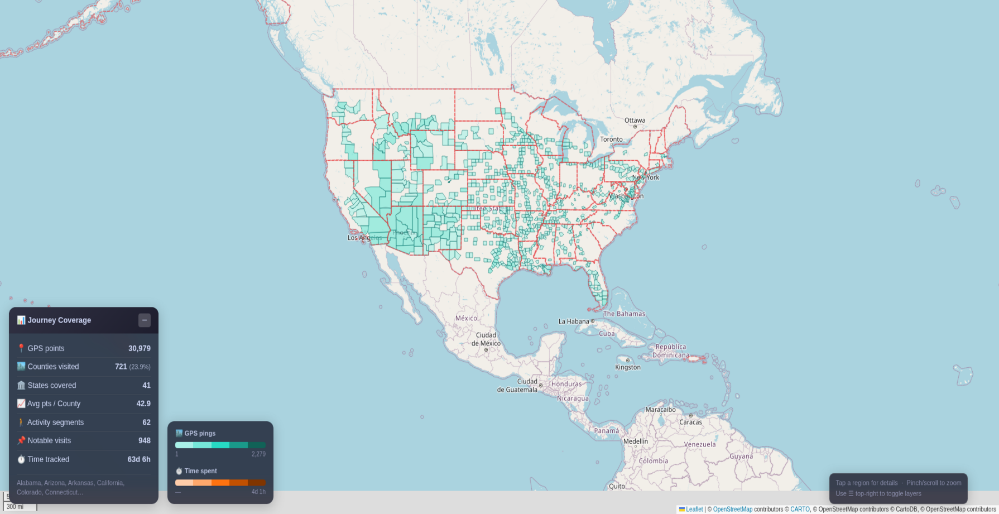

# WanderGlyph

[](https://www.python.org/)
[](./LICENSE)
[](#)

<p align="center">
  
</p>

**WanderGlyph** turns your Google Timeline GPS export into a rich, interactive travel map — every U.S. county, state, or country you've ever visited, plus how many **National Park Service sites** you've covered — with activity trails, heatmaps, dwell-time analysis, and year-over-year breakdowns.

---

## ✨ Features

- 🗺️ **Four aggregation levels** — County, State, Country, or **NPS sites** (national parks, monuments, historic sites, etc.)
- 🎨 **Three map themes** — Light, Dark, Satellite, all with a modern glassmorphism UI
- 🏙️⏱️ **Two ways to see coverage** — toggle between "by GPS pings" and "by time spent" choropleths (ping density is a sampling artifact; dwell time from your `visit` records is the truer signal)
- 🏠 **Home county highlight** — gold marker for your home base, plus a "farthest visited" distance stat
- 🔥 **Heatmap** with colour gradient showing GPS density
- 🚶 **Activity segments** — walking, driving, cycling, transit, flying — each as a separate toggleable layer
- 📌 **Notable visits** — places you've stopped at, with visit counts and dwell time per region
- 📅 **Year-over-year layers** — see how your travel grew over time
- 📱 **Recent GPS path** — your last 100 recorded points as a trail
- 📊 **Animated coverage panel** — regions visited, states covered, time tracked, and more
- 🌲 **NPS mode** — see all 442 National Park Service units on the map (visited ones highlighted), a strict "National Parks visited" count, and a state-by-state browser
- 📋 **JSON summary report** — exportable stats file
- 📥 **Auto-download boundary data** — counties, states, world countries, and NPS units, cached locally after the first run
- ⚡ **Spatial join cache** — re-runs on the same file are instant
- 📁 **Multi-file / directory input** — combine multiple Timeline exports
- 📆 **Date range filtering** — isolate any time period
- 📱 **Mobile-friendly** — responsive layout, touch-optimised markers

---

## 📦 Requirements

- Python 3.10+ (note: on Python 3.13+, optional HTML minification is unavailable — see [Notes](#-notes))
- Dependencies listed in [`requirements.txt`](./requirements.txt)
- A Google Timeline JSON export (see below)

---

## 🚀 Installation

```bash
git clone https://github.com/yourusername/wanderglyph.git
cd wanderglyph
python3 -m venv venv
source venv/bin/activate
pip install -e ".[dev]"     # or: pip install -r requirements.txt
```

Boundary data (U.S. counties, states, world countries, NPS units) is downloaded automatically the first time each level is used, when you pass `--auto-download`. After that, it's cached on disk and never re-downloaded.

---

## 📤 How to Export Your Google Timeline Data

1. Go to [Google Takeout](https://takeout.google.com/)
2. Deselect all, then select **Location History (Timeline)**
3. Choose **JSON** format and export
4. Extract the downloaded `.zip` — you'll find one or more `Timeline.json` files

---

## 📖 Usage

### Basic

```bash
python wanderglyph.py --json-file Timeline.json --auto-download --open
```

`--auto-download` only matters on first run per level — it fetches the matching boundary data once and reuses it from disk on every run after. `--open` pops the finished map straight into your browser.

### With options

```bash
python wanderglyph.py \
  --json-file Timeline.json \
  --theme dark \
  --home-county "Travis County, TX" \
  --add-markers \
  --open
```

### Multiple files or a whole directory

```bash
# Two files
python wanderglyph.py --json-file 2023.json 2024.json --theme dark

# Entire folder
python wanderglyph.py --json-file ~/Takeout/Location\ History/
```

### Filter by date range

```bash
python wanderglyph.py --json-file Timeline.json \
  --start-date 2024-01-01 --end-date 2024-12-31 \
  --theme light
```

### State or country level

```bash
# State level
python wanderglyph.py --json-file Timeline.json --level state

# World map (downloads world shapefile automatically)
python wanderglyph.py --json-file Timeline.json --level country \
  --auto-download --theme satellite
```

### Export extras

```bash
python wanderglyph.py --json-file Timeline.json \
  --export-geojson counties.geojson \
  --export-points  points.geojson \
  --summary        summary.json
```

### Keeping multiple maps around

Each run writes one self-contained HTML file and **overwrites** whatever's already at `--output-map` — it doesn't merge with a previous run. Give each level its own filename to keep them all:

```bash
python wanderglyph.py --json-file Timeline.json --level county --home-county "Travis County, TX" \
  --output-map maps/county_map.html

python wanderglyph.py --json-file Timeline.json --level nps --auto-download \
  --output-map maps/nps_map.html --open
```

---

## 🌲 NPS Mode — "How many National Park sites have I visited?"

`--level nps` matches your GPS history against the **official NPS Land Resources Division boundary data** — all 442 National Park Service units nationwide (national parks, monuments, historic sites, seashores, memorials, battlefields, and more).

```bash
python wanderglyph.py --json-file Timeline.json --level nps --auto-download --open
```

What you get, beyond the standard coverage map:

- **🌲 All NPS Sites layer** — every one of the 442 units drawn on the map (solid muted fill), so you can see the whole system, not just what you've hit. Visited ones stand out in color on top.
- **🏔️ National Parks stat** — a strict count of the 62 units actually designated "National Park" (e.g. Yellowstone, Yosemite), separate from the broader "NPS sites visited" total which includes monuments, historic sites, etc.
- **🔎 Browse by State** — a dropdown in the top-left of the map. Pick any state and see the list of NPS sites you've visited there, with type, GPS points, and time spent, sorted by most-visited first. (Desktop only for now — hidden on narrow/mobile screens to avoid clutter.)
- Everything else works too: the 🏙️/⏱️ ping-density vs. time-spent toggle, popups with visit counts and first/last visit dates, all applied to NPS units instead of counties.

First run downloads the boundary data (~3 MB) to `nps_boundary/nps_boundary.geojson` in your project directory; every run after that reuses the cached file.

---

## 🚩 Full CLI Reference

| Flag | Default | Description |
|---|---|---|
| `--json-file PATH [PATH ...]` | **required** | One or more JSON files, or a directory |
| `--output-map FILE` | `output_map.html` | Output HTML filename |
| `--project-dir DIR` | `.` | Directory for boundary/shapefile data |
| `--auto-download` | off | Download missing boundary data automatically |
| `--start-date YYYY-MM-DD` | — | Only include points on/after this date |
| `--end-date YYYY-MM-DD` | — | Only include points on/before this date |
| `--level` | `county` | Aggregation level: `county` `state` `country` `nps` |
| `--theme` | `light` | Map theme: `light` `dark` `satellite` |
| `--home-county "Name, ST"` | — | Highlight home county in gold e.g. `"Travis County, TX"` (county level only) |
| `--add-markers` | off | Add clustered GPS markers |
| `--export-geojson FILE` | — | Export matched regions as GeoJSON |
| `--export-points FILE` | — | Export GPS points as GeoJSON |
| `--summary FILE` | — | Write JSON summary report |
| `--open` | off | Open map in browser after generating |
| `--no-cache` | off | Skip cache, always recompute spatial join |
| `--clear-cache` | — | Delete all cached results and exit |
| `--verbose / -v` | off | Enable debug logging |

---

## 🎨 Color Scheme

### Map themes

| Theme | Region fill (GPS pings) | Region fill (time spent) | State borders | Base map |
|---|---|---|---|---|
| `light` | Blue `#3b82f6` ramp | Orange `#f97316` ramp | Red `#ef4444` | CartoDB Positron |
| `dark` | Teal `#2dd4bf` ramp | Orange `#f97316` ramp | Red `#ef4444` | CartoDB Dark Matter |
| `satellite` | Green `#34d399` ramp | Orange `#f97316` ramp | Red `#ef4444` | ESRI World Imagery |

Each ramp runs light → dark across 5 buckets, based on how many GPS points (or how much time) that region accounts for relative to the others. A legend panel on the map shows the exact ranges.

### Activity segment colours (all themes)

| Activity | Colour |
|---|---|
| Walking / Running / Hiking | Green |
| Cycling | Orange |
| Driving / In vehicle | Blue |
| Train / Bus / Subway / Ferry | Purple |
| Flying | Red |
| Other | Grey |

### Special layers

| Layer | Colour |
|---|---|
| 🏠 Home county | Gold `#f59e0b` |
| 📌 Notable visits | Amber `#fbbf24` |
| 🔥 Heatmap | Blue → Orange → Red gradient |
| 📱 Recent path | Green |
| 🌲 All NPS sites (unvisited) | Slate grey `#94a3b8` |

---

## 🗂️ Project Structure

```
WanderGlyph/
├── wanderglyph.py        # CLI entry point
├── requirements.txt
├── pyproject.toml
├── src/
│   ├── core.py           # Orchestration
│   ├── data_loader.py    # JSON parsing, shapefile/boundary loading
│   ├── geo_utils.py      # Spatial join, home county lookup, dwell-time & distance stats
│   ├── visualization.py  # Folium map generation
│   ├── coordinates.py    # Coordinate extraction
│   ├── cache.py          # Spatial join result caching
│   ├── downloader.py     # Auto-download boundary data (Census, Natural Earth, NPS)
│   └── summary.py        # JSON summary report
├── tests/                # pytest suite for the core pipeline
└── png/
    └── logo.png
```

---

## 🧪 Running the Tests

```bash
pip install -e ".[dev]"
pytest
```

Covers coordinate parsing, JSON loading, spatial matching, home-county lookup, dwell-time/distance stats, and the caching layer.

---

## 📍 Example Output

- Interactive map of all visited counties / states / countries / NPS sites
- Toggleable GPS-density vs. time-spent choropleths, with a legend
- Heatmap of GPS point density
- Activity trails coloured by transport type
- Year-by-year point layers
- Animated coverage statistics panel, with a state-by-state NPS browser in `--level nps` mode



---

## 📝 Notes

- **HTML minification is optional.** `htmlmin` shrinks the output file but fails to install on Python 3.13+ (it depends on the removed stdlib `cgi` module). If it's missing, WanderGlyph just skips minification and logs a note — maps still generate normally, just slightly larger.
- **Large files (>100 MB)** parse faster with `ijson` installed: `pip install ijson` (or `pip install -e ".[streaming]"`).

---

## 🛠️ Contributing

Fork → Branch → Commit → Push → PR 🚀

WanderGlyph is actively developed. Got a feature idea or bug report?
Open an issue or reach out at **royyraa@outlook.com**

---

## 📄 License

This project is licensed under the [MIT License](./LICENSE).
